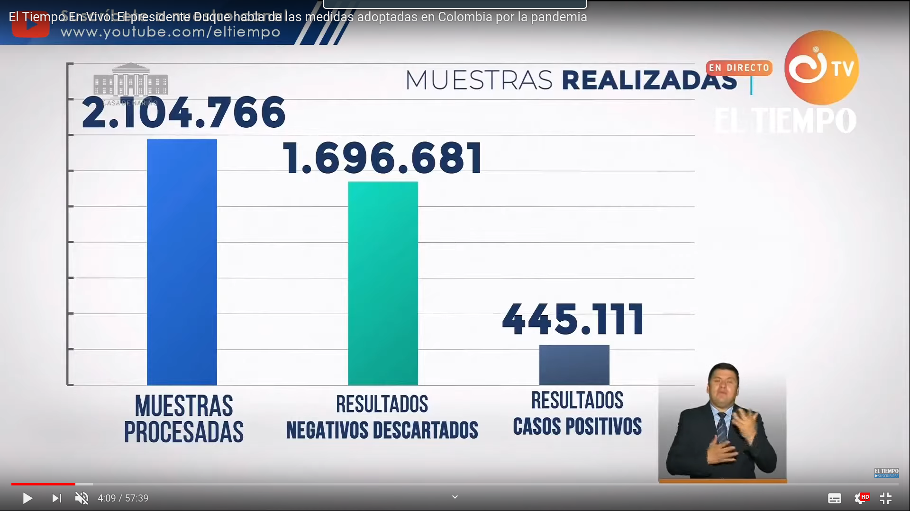

```{r setup, include=FALSE}
knitr::opts_chunk$set(echo = FALSE,
                      message = FALSE,
                      warning = FALSE)
```

## Gráfica original muestras realizadas

En el programa de TV institucional "Prevención y Acción" por parte del Gobierno
Nacional, el día 14 de agosto de 2020 apareció la siguiente gráfica en donde
se observa el número de muestras.




## Observaciones a la gráfica

 - La proporción con los renglones que se marcan ahí no es correcta, las muestras procesadas deberían
   ser unos 5 renglones de los resultados de casos positivos y se ve que es mucho mas casí unos 6 o 7.
 - No indica la escala en el eje "y".
 - La suma de las pruebas realizadas no da el número que se muestran como procesadas
   dan más de lo indicado ahí.

 
 
## Propuesta de una mejor gráfica

```{r}
library(readxl)

datos_muestras <- read_excel("Muestras.xlsx") # Lectura de la base de datos.
```


```{r}
total_muestras <- sum(datos_muestras$Resultados)
muestras <- c(total_muestras, datos_muestras$Resultados)/1000000
```

```{r}
colores <-c("#0c67da", "#14b8ad", "#808080") 

bp1 <- barplot(height = muestras, 
               
               main="Muestras realizadas por Covid-19. Agosto 13 de 2020",
               names.arg = c("Muestras totales", datos_muestras$Tipo_muestras),
               axes = FALSE,
               col = colores,
               border = colores,
               ylab = "Muestras hechas (en millones)",
               ylim = c(0,2.5)
       )

grid(nx = NA, ny = 8)
axis(2, at = seq(0, 3, by=0.5),
     las = 1)
text(bp1, muestras/2, labels = 
       paste(format(round(muestras * 1000000), nsmall=0, big.mark=","), "\nMillones")
    )

```


