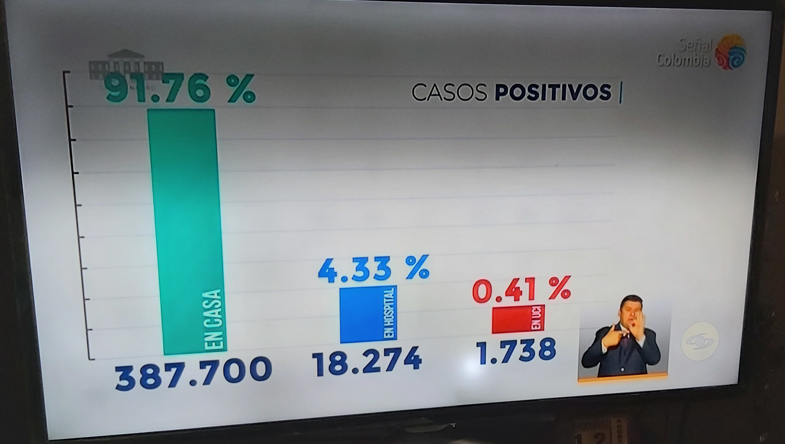

```{r setup, include=FALSE}
knitr::opts_chunk$set(echo = FALSE,
                      message = FALSE,
                      warning = FALSE)
```

## Gráfica original casos positivos para COVID-19.

En el programa de TV institucional "Prevención y Acción" por parte del Gobierno
Nacional, el día 12 de agosto de 2010 apareció la siguiente gráfica en donde
se muestra la distribución de los casos positivos en Colombia hasta ese día.



## Observaciones a la gráfica.

 - Se nota que los valores porcentuales no guardan la proporción correcta.
 - No se indica la escala en el eje "y".
 - Los casos "EN UCI" se dice que son 1.738, y en la escala ocupa un renglón,
   y los casos "EN HOSPITAL" ocupa dos renglones como si 18.274 fuera el 
   doble de 1.738.
 - Se puede mejorar el título.
 - Los cálculos de los porcentajes no son correctos, si se toma el 100% 
   la suma de todos los pacientes en los tres estados.
 
 
## Propuesta de una mejor gráfica.

```{r}
# Lectura de la base de datos sencilla en donde está los datos para categoría.
library(readxl) # Cargar la biblioteca readxl, para leer archivos excel.

datos_infectados <- read_excel("infectados.xlsx") # Lectura de la base de datos.
```


```{r}
# Cálculo de los porcentajes.
# Obtiene el número total de personas.
total_infectados <- sum(datos_infectados$Pacientes) 
# Obtiene la distribución porcentual como una columna mas de la base de datos.
datos_infectados$porcentaje <- datos_infectados$Pacientes/total_infectados*100
```

```{r}
# Definición de colores con código en número hexadecimales.
colores <-c("#14b8ad", "#0c67da", "#cc1f0e") 
# Creación del diagrama de barras.
bp1 <- barplot(height = datos_infectados$Pacientes/1000, # Altura de las barras.
        space = 0.5, # Espacio entre las barras
        # Título de la gráfica
        main = "Distribución de infectados por COVID-19 en Colombia.\n Miércoles, 12 de agosto de 2020",
        # Nombres de las barras.
        names.arg = datos_infectados$Estado,
        # Asignación de colores.
        col = colores,
        # Asignación de colores a los bordes de las barras.
        border = colores,
        # Supresión de los ejes.
        axes = FALSE,
        # Límites de los valores del eje "y".
        ylim = c(0, 400),
        # Etiqueta del eje "y".
        ylab = "Número de personas (en miles)")

grid(nx = NA, ny = 8)
# Definción de las etiquetas del eje "y".
axis(2, at = c(0, 50, 100, 150, 200, 250, 300, 350, 400),
     las = 1)

# Definición de texto dentro de la gráfica.
# Porcentajes.
text(bp1, c(200, 85, 85),
     labels = paste(formatC(round(datos_infectados$porcentaje, 2),
                            digits = 4, decimal.mark = ",",
                            big.mark = "."),
                    "%"))
# Número de personas.
text(bp1, c(150, 35, 35),
     labels =formatC(datos_infectados$Pacientes, big.mark = ".",
                     decimal.mark = ",",
                     digits = 6))
```


